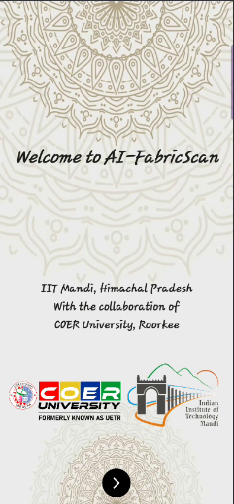
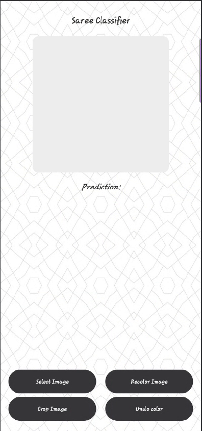
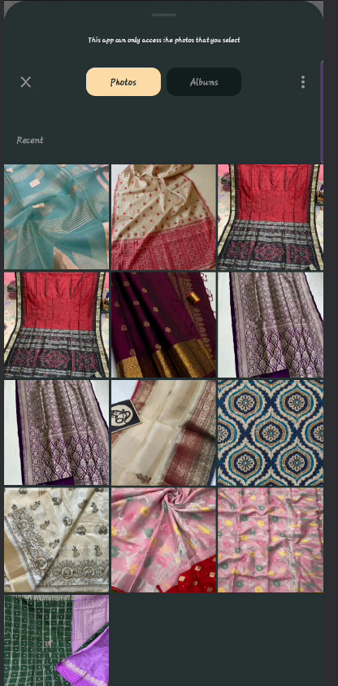
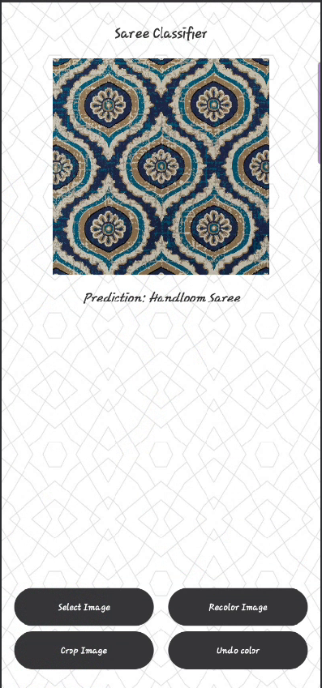
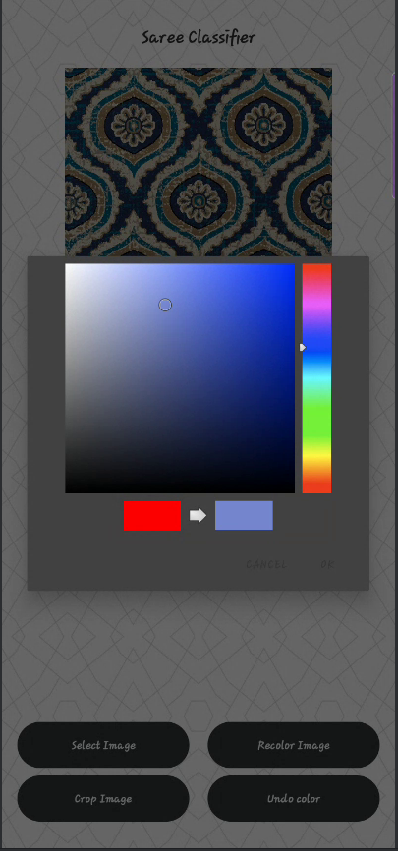
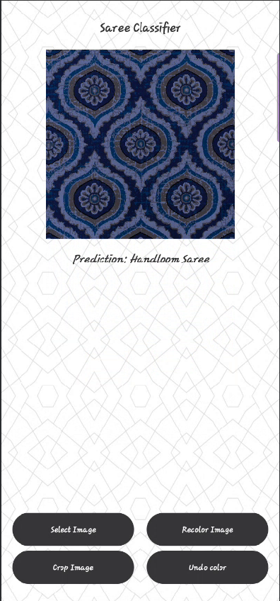
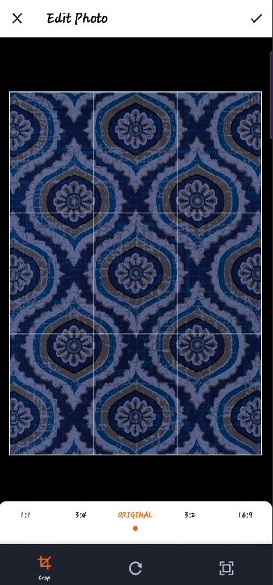

# 🧵 Saree Classifier - Handloom vs Powerloom

This project uses a Convolutional Neural Network (CNN) model to classify saree images as either **Handloom** or **Powerloom**. It includes a full ML pipeline from data loading and training to real-time inference using a TensorFlow Lite model integrated into an Android app.

---

## 📱 Features

- Classifies sarees into Handloom or Powerloom categories using image input.
- Built using TensorFlow and Keras with optimized preprocessing and data augmentation.
- Real-time classification on Android using TensorFlow Lite.
- Supports image cropping, recoloring, and undo recoloring features for better visual analysis.
- Clean, modern UI design implemented with Kotlin and XML in Android Studio.

---

## 🧠 Model Architecture

- Input image: 128x128 RGB
- 3 Convolutional Layers + MaxPooling
- Dense Layer with Dropout for regularization
- Output Layer with Softmax for 2-class prediction
- Optimizer: Adam | Loss: Sparse Categorical Crossentropy

---

## 🧪 Dataset

- Custom dataset of Handloom and Powerloom saree images
- Preprocessed: resized to 128x128, normalized
- Augmented with rotation, zoom, flip, and shift transformations

---

## 🚀 How to Use

### 🧠 Train the Model (Python)

1. Place images in `dataset/handloom/` and `dataset/powerloom/`
2. Run the training script:
    ```bash
    python train_model.py
    ```
3. This will generate:
    - `saree_classifier.keras` – trained model
    - `saree_classifier.tflite` – optimized TensorFlow Lite model

---

### 📲 Android App Integration

- Open the Android project in Android Studio.
- Add the `.tflite` model to `assets/`.
- The app supports:
  - Image selection and cropping (via uCrop)
  - Recoloring filters and undo functionality
  - Real-time on-device saree classification

---

## 🛠️ Technologies Used

- TensorFlow, Keras, NumPy, OpenCV
- Kotlin, XML, Android Studio
- uCrop library for image cropping
- TensorFlow Lite for mobile inference

---

## 📸 Screenshots

      

---

## 📦 Project Structure

├── dataset/ │ ├── handloom/ │ └── powerloom/ ├── train_model.py ├── saree_classifier.keras ├── saree_classifier.tflite └── AndroidApp/ ├── app/ └── ...


---

## 📄 License

This project is open source and available under the [MIT License](LICENSE).

---

## 🙌 Acknowledgements

- TensorFlow & Keras for ML Framework
- Android uCrop Library

---

